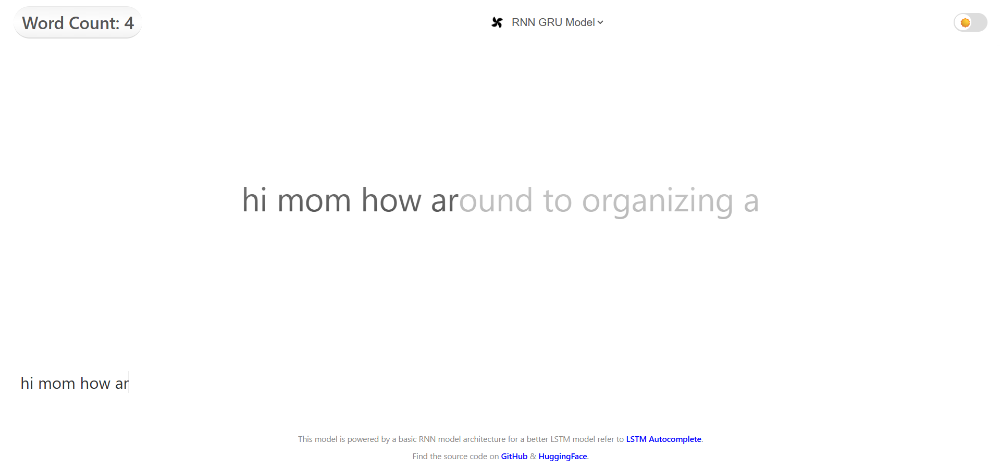

<pre style="white-space: pre-wrap; word-wrap: break-word; font-size: 2vw;">
 █████╗ ██╗   ██╗████████╗ ██████╗  ██████╗ ██████╗ ███╗   ███╗██████╗ ██╗     ███████╗████████╗███████╗    ███╗   ███╗███████╗
██╔══██╗██║   ██║╚══██╔══╝██╔═══██╗██╔════╝██╔═══██╗████╗ ████║██╔══██╗██║     ██╔════╝╚══██╔══╝██╔════╝    ████╗ ████║██╔════╝
███████║██║   ██║   ██║   ██║   ██║██║     ██║   ██║██╔████╔██║██████╔╝██║     █████╗     ██║   █████╗      ██╔████╔██║█████╗  
██╔══██║██║   ██║   ██║   ██║   ██║██║     ██║   ██║██║╚██╔╝██║██╔═══╝ ██║     ██╔══╝     ██║   ██╔══╝      ██║╚██╔╝██║██╔══╝  
██║  ██║╚██████╔╝   ██║   ╚██████╔╝╚██████╗╚██████╔╝██║ ╚═╝ ██║██║     ███████╗███████╗   ██║   ███████╗    ██║ ╚═╝ ██║███████╗
╚═╝  ╚═╝ ╚═════╝    ╚═╝    ╚═════╝  ╚═════╝ ╚═════╝ ╚═╝     ╚═╝╚═╝     ╚══════╝╚══════╝   ╚═╝   ╚══════╝    ╚═╝     ╚═╝╚══════╝                                                                                </pre>  


## Autocomplete Me is a Python project I built to replicate the autocomplete behavior you see in modern systems like Google, Apple's typing suggestions.

The main goal of this project is to predict the next likely characters or words based on what’s already typed basically teaching a model how to guess your thoughts mid-sentence.
There are two deep learning models implemented here that serve the same core purpose (next-character prediction), but they behave quite differently in terms of sentence structure and coherence.
There are 2 models in this project serving the same functionality (prediction of charecters that comes next according to the previous charecters and words)

***GRU MODEL***

The first model is made of a GRU architecture it works heres a demo of the GRU model
"hi mom how ar(ound to organizing a)..." 

This sentence shows a lesser accuracy to how we actually speak although each words it forms kind of make sense the words together dosent make too much sense
The way it arranges each charecters make a good enough sequence model to form cohorent words but not a cohorent sentence!!!
Still, it’s a solid sequence model that learns character patterns nicely — you can see it generating coherent words even though the sentence structure is off. That’s because GRUs, although efficient, tend to forget long-term dependencies — so while it understands word formation quite well, it struggles to link words meaningfully over a longer context.

***LSTM MODEL***

The next model i.e. made of of the lstm architechture shows considerable improvement than the previous one it correctly guesses and forms a coherent sentence 
"hi mom how ar(e you did you see th)..." 

The LSTM model is making a much better prediction of sequence to form cohorent sentences...It starts forming semantically coherent sentences, not just random words. The model seems to have learned conversational flow.This shows that the LSTM’s longer memory is doing its job right — capturing both context and sentence-level dependencies, giving it a real human-like flow almost like it’s genuinely asking “Hi mom, how are you? Did you see the…” THAT IS A SIGNIFICANT IMPROVEMENT!!!

***Dataset***

I have listed the dataset publicly in this repository too incase anyone wants to add anything to it and advance the model further

***API***

You can find api server that serves the api through FastAPI for both the models in ports **http://127.0.0.1:8000 (GRU) | http://127.0.0.1:8001 (LSTM)** respectively

***Usage***

I have also made a cool frontend linked as the index.html file in this repository I would like you to use the model yourself in there


**steps**

*To run the models locally*
1. install the requirements file 
```python
pip install -r requirements.txt
```
2. run the server file called api_server.py
3. run the index.html file frontend
   *for switching models change the model in the topbar area*

## License

This project is licensed under the [MIT License](LICENSE).

You are free to use, modify, and distribute this project for any purpose, provided that proper credit is given to the original author — **Sagnik Roy (github.com/@Sagnikkroy)**


